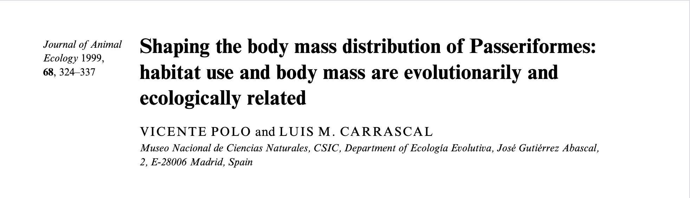
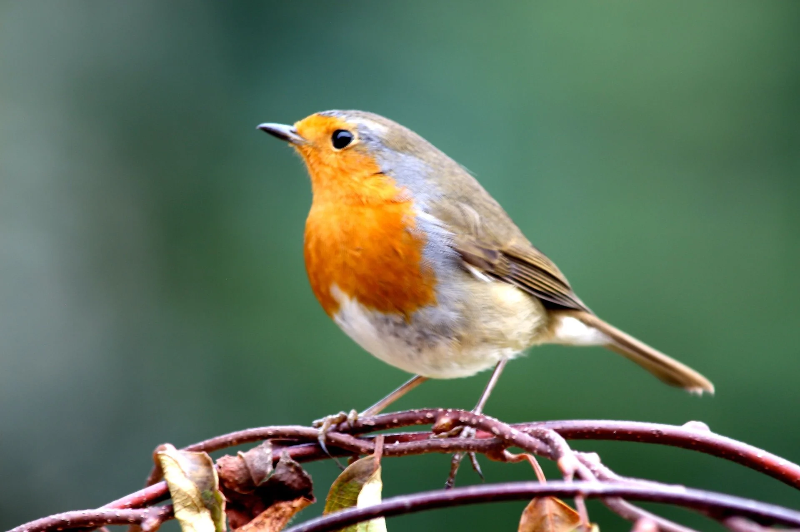

```{r install-package, include = FALSE, eval = FALSE}
# Copy and paste the following code into your console to download and install
# the `xaringan` package that contains all of the code which allows you 
# to create presentation slides in Rmarkdown
install.packages('xaringan')
```


```{r load-packages, include = FALSE}
# Add any additional packages you need to this chunk
library(tidyverse)
library(tidymodels)
library(palmerpenguins)
library(knitr)
library(xaringanthemer)

library(readxl)
library(janitor)
library(broom)
library(parsnip)
library(rsample)
library(tune)
library(recipes)
library(workflows)
library(ranger)
library(yardstick)
library(ggridges)
```

```{r setup, include=FALSE}
# For better figure resolution
knitr::opts_chunk$set(fig.retina = 3, dpi = 300, fig.width = 6, fig.asp = 0.618, out.width = "80%")
```

```{r load-data, include=FALSE}
BirdLife_file <- read.csv("data/AVONET1_BirdLife.csv")

```

```{r include=FALSE}

#Background image
style_xaringan(
  title_slide_background_image = "img/British_birds.jpg"
)

```

background-color: #f7fbff
color: #003049
# Background and Data

.pull-left[
 
- Differences in traits based on habitats
 
- Prior research suggests a correlation between body mass and habitat structure

- Passeriformes: largest and most diverse bird order

- Does the AVONET data shows similar patterns?


]
.pull-right[
```{r Passeriformes1, echo = FALSE, out.width = "190%", fig.align = "center"}

```
]
---
background-color: #f7fbff
class: center, middle

## How does body mass in Passerformies vary between open and dense habitats, and to what extent do additional traits help explain habitat preference?
---

background-color: #f7fbff
# Cleaning the data

.pull-left[
 - AVONET data set: functional traits for all bird species.


 - Difference in which species within the Passeriformes were used


 - Worked with the species average-measurments data set


 - Habitat.density: discrete variable ranging from 1 = dense to 3 = open.


 - Combined semi-open and open categories due to different sample sizes

 
]
.pull-right[
```{r cleaning}
# Cleaning

BirdLife <- BirdLife_file %>%
  filter(Order1 == "Passeriformes", 
         !is.na(Habitat.Density))%>%
  mutate(
    Habitat.Density = case_when(
      Habitat.Density == 1 ~ "Dense",
      Habitat.Density == 2 | 3 ~ "Open",
    ),
    Habitat.Density = fct_relevel(Habitat.Density, "Dense", "Open")
  )
```
]

---
background-color: #f7fbff
# Exploratory Statistics

.pull-left[
- Our results show a different trend than the published study


- Birds in open habitats are slightly lighter on average


- The dense vs. open groups are similar in size
]

.pull-right[
```{r, echo = FALSE}
#Summary statistics
Summary_table <- BirdLife %>%
  group_by(Habitat.Density) %>%
  summarise(Mean = mean(Mass), Median = median(Mass), Total = n_distinct(Species1))

kable(Summary_table, digits = 3, format = "html")

#BirdLife %>%
  #group_by(Habitat.Density, outlier = Mass > 150) %>%
  #summarise(n = n())

#BirdLife %>%
  #group_by(Habitat.Density, crow = Family1 == "Corvidae") %>%
  #summarise(n = n())
```
]

---


```{r recode-species, echo = FALSE}
# In this chunk I'm doing a bunch of analysis that I don't want to present 
bird_long <- BirdLife %>%
  pivot_longer(
    cols = c(Mass),
    names_to = "Trait",
    values_to = "Value"
  ) #%>%
  #mutate(
   # Value_plot = if_else(Trait == "Mass", log10(Value), Value)
  #)
# in my slides. But I need the resulting data frame for a plot I want to present.
iris_modified <- iris %>%
  mutate(Species = fct_other(Species, keep = "setosa"))
```


background-color: #f7fbff
## Distrubution of Body Mass


.pull-left[
 - Use of log scale


 - Both habitats show a left-skewed distribution


  - Dense habitat has two peaks, slightly more left


 - Similar IQRs, though open habitats have a slightly smaller middle-spread


 - Most outliers are part of Corvidae (crow family)
]
.pull-right[
```{r histogram, echo = FALSE, out.width = "75%"}
ggplot(BirdLife, aes(x = Mass, fill = Habitat.Density)) +
  geom_histogram(bins = 100) +
  scale_x_log10() +
 facet_wrap(~ Habitat.Density) + 
  labs(title = "Mass Distribution by Habitat Density (log scale)",
       x = "Mass (log10 g)",
       y = "Count") +
  theme_minimal() +
  theme(legend.position = "none")

# theme options: https://ggplot2.tidyverse.org/reference/ggtheme.html
```

```{r warning=FALSE, out.width="75%", fig.width=4, echo=FALSE}
# see how I changed out.width and fig.width from defaults
# to make the figure bigger
ggplot(bird_long, aes(x = Trait, y = Value, color = Habitat.Density)) +
  geom_boxplot(fill = NA, width = 0.6, outlier.shape = 1) +  
  facet_wrap(~ Habitat.Density) + 
  scale_y_log10() +   
  labs(title = "Mass by Habitat Density",
       x = "Trait",
       y = "Value (log10 scale)") +
  theme_minimal() +
  theme(
    strip.text = element_text(face = "bold"),
    legend.position = "none",
  )
```
]

---
background-color: #f7fbff
# Modelling: Are there other predictors than mass?

.pull-left[

- Used cross validation

- Body mass alone not a strong enough predictor
]
.pull-right[
```{r model building, echo = FALSE}

set.seed(222)
BirdLife_split <- initial_split(BirdLife)

train_data <- training(BirdLife_split)
test_data <- testing(BirdLife_split)

folds <- vfold_cv(train_data, v = 10)
  
rec_mass <- recipe(
  Habitat.Density ~ Mass,
  data = train_data
) %>%
  step_zv(all_predictors())

mod_glm <- logistic_reg() %>%
  set_engine("glm")

wflow_mass <- workflow() %>%
  add_model(mod_glm) %>%
  add_recipe(rec_mass)

cv_mass <- fit_resamples(
  wflow_mass,
  resamples = folds,
  metrics = metric_set(roc_auc),
  control = control_resamples(save_pred = TRUE)
)


rec_multi <- recipe(
  Habitat.Density ~ Mass + Wing.Length + Beak.Length_Culmen + Beak.Length_Nares
+ Beak.Width + Beak.Depth + Tarsus.Length + Wing.Length + Kipps.Distance + Tail.Length,
  data = train_data
) %>%
  step_zv(all_predictors())

wflow_multi <- workflow() %>%
  add_model(mod_glm) %>%
  add_recipe(rec_multi)

fit_multi <- wflow_multi %>%
  fit(data = train_data)

cv_multi <- fit_resamples(
  wflow_multi,
  resamples = folds,
  metrics = metric_set(roc_auc),
  control = control_resamples(save_pred = TRUE))


comperasion <- bind_rows(
  collect_metrics(cv_mass)  %>% mutate(model = "Mass only"),
  collect_metrics(cv_multi) %>% mutate(model = "All measurements")
) 

comperison_table <- comperasion %>%
  select(.metric, mean, std_err, model) %>%
  rename(
    Metric = .metric,
    Mean = mean,
    Std_Error = std_err,
    Model = model
  )

kable(comperison_table, digits = 3, format = "html")

```
]
---
background-color: #f7fbff
# Final modelling

.pull-left[
```{r Fitted model w multiple varibles, echo = FALSE}

fit_table <- tidy(fit_multi) %>%
  select(term, estimate,  std.error) %>%
  rename(
    Term = term,
    Estimate = estimate,
    Std_Error = std.error
  )
kable(fit_table, digits = 3, format = "html")

```
]
.pull-right[
```{r ROC-curve, echo = FALSE, out.width = "135%"}
final_fit <- wflow_multi %>%
  fit(data = test_data)

train_pred <- predict(final_fit, test_data, type = "prob") %>%
  bind_cols(test_data)

train_pred %>%
  roc_curve(
    truth = Habitat.Density,
    .pred_Dense,
    event_level = "first"
  ) %>%
  autoplot()
```
]

```{r Calculating area under curve, echo = FALSE, results = "hide"}
train_pred %>%
  roc_auc(
    truth = Habitat.Density,
    .pred_Dense,
    event_level = "first"
  )

```
---
background-color: #f7fbff
# Limitations / Summary

.pull-left[
```{r castle, echo = FALSE, out.width = "85%", fig.align = "center", fig.cap = "Image credit: Photo by Hans Rentsch on Green Feathers."}

```
]
.pull-right[

Limitations:
- Species traits are based on average measurements

- Habitat categories were simplified


- Different families within Passeriformes and uses different habitat definitions.

Conlcusion:
- Habitat-type seems to be influenced by multiple traits


- Further exploration
]


---
background-color: #f7fbff
# Refrences

Tobias, J. A., Sheard, C., Pigot, A. L., M. Devenish, A. J., Yang, J., Sayol, F., C. Neate-Clegg, M. H., Alioravainen, N., Weeks, T. L., Barber, R. A., Walkden, P. A., A. MacGregor, H. E., I. Jones, S. E., Vincent, C., Phillips, A. G., Marples, N. M., Montaño-Centellas, F. A., Leandro-Silva, V., Claramunt, S., . . . Schleuning, M. (2022). AVONET: Morphological, ecological and geographical data for all birds. _Ecology Letters_, _25_(3), 581-597. https://doi.org/10.1111/ele.13898

Polo, V., & Carrascal, L. M. (1999). Shaping the body mass distribution of Passeriformes: Habitat use and body mass are evolutionarily and ecologically related. Journal of Animal Ecology, 68(2), 324-337. https://besjournals.onlinelibrary.wiley.com/doi/10.1046/j.1365-2656.1999.00282.x 
